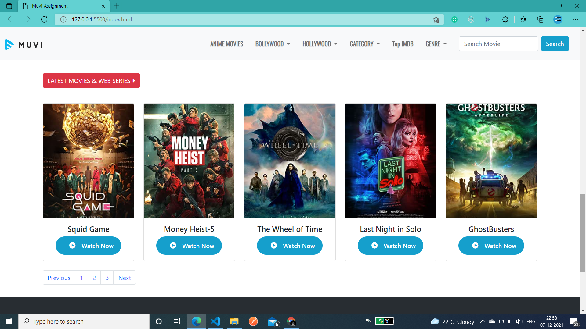

# Muvi_Assesment_2021

## Home Page With Navbar and Dropdown Menus

## Home Page Main Contents with Rows 
### Screenshot-1

### Screenshot-2

### Screenshot-3

### End of Main Content and Footer

## Meta Data show using Modal
### Screenshot-1

### Screenshot-2

